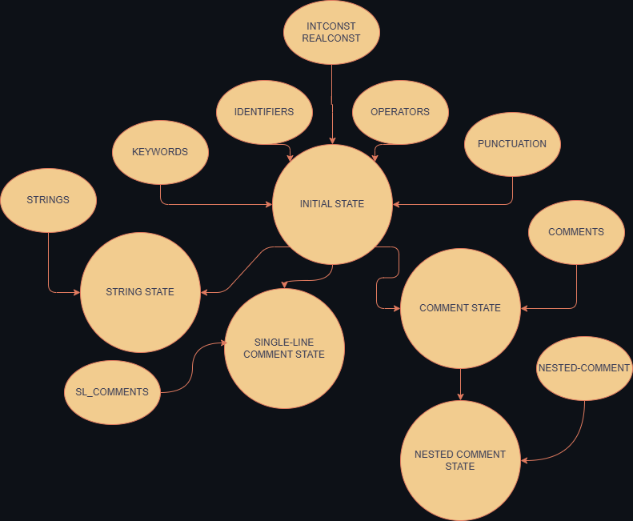
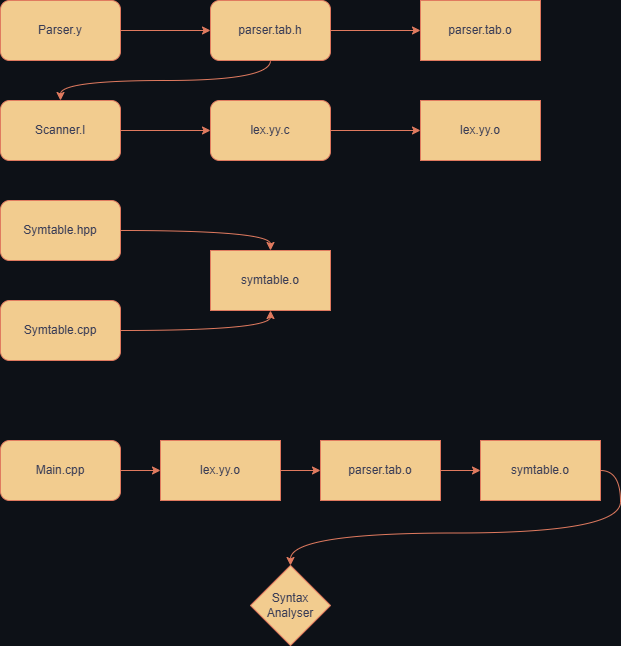

# HY340: Alpha Compiler Project

## Project Description

Our main quest is to make a compiler for language Alpha in 5 phases. The compiler will be able to compile the language and produce an executable file. The language is a simple one, with basic arithmetic operations, loops, conditionals, functions, and arrays. The compiler will be written in C++.

- Phase 1: Lexical Analysis.
- Phase 2: Syntax Analysis.
- Phase 3: Intermediate Code Generation.
- Phase 4: Final Code Generation.
- Phase 5: VM Implementation.

## Team Members

- csd4676 Dimitrios Makrogiannis.
- csd4621 Katerina Gyparaki.
- csd5140 Kallia Samaritaki.

## Project Guidelines

- [Phase 1](./documents/phase1.pdf)
- [Phase 2](./documents/phase2.pdf)
- [Phase 3](./documents/phase3.pdf)
- [Phase 4-5](./documents/phase4_5.pdf)

## Phase A

In phase A we were asked to make the Lexer and make a lexical analysis of the language. We had to make a program that reads the input file and produces a list of tokens. The tokens are the smallest units of the language, such as keywords, identifiers, numbers, and symbols. The program should be able to recognize the tokens and print them in the output file.

The program is able to run and tested with edge cases and it works as expected. The program is written in C++.

The Lexer works like a Finite State Machine (FSM). It reads the input file character by character and decides which state to go to. The states are as the following:

- Start: The initial state.
- Comment: The state when the program is in a comment.
- String: The state when the program is in a string.
- NestedComment: The state when the program is in a nested comment.

Below follows an image to demonstrate the FSM of the Lexer:



The program is able to recognize the following tokens:

- Keywords for alpha language.
- Identifiers.
- Numbers(Integers/Real).
- Operators.
- Punctuation symbols.
- Strings.
- Comments.

## Runs in oneiro server with the following command

```bash
    - make clean
    - make all
    - ./scanner.exe input_file output_file("optional")
```

## Phase B

In phase B we were asked to make the Parser and make a syntax analysis of the language. We had to make a program that reads the list of tokens from the Lexer and store them to a symbol table. The symbol table is a hashtable that stores the tokens, their type and their scope. The tokens are also stored in a linked list in the same data structure based on their scope and order of appearance. The program is able to recognize the tokens and print them in the output file.

The program is able to run and tested with edge cases and it works as expected. The program is written in C++.

The Parser works like a Recursive Descent Parser. It reads the list of tokens and decides which function to call based on the grammar of the language. The grammar is as in the documentation for the Phase 2 of the project.

Below follows an image to demonstrate the Recursive Descent Parser of the Parser:



## Runs in oneiro server with the following command

```bash
    - make clean
    - make all
    - ./parser.exe input_file output_file("optional")
```

## Phase C

## Phase D-E
